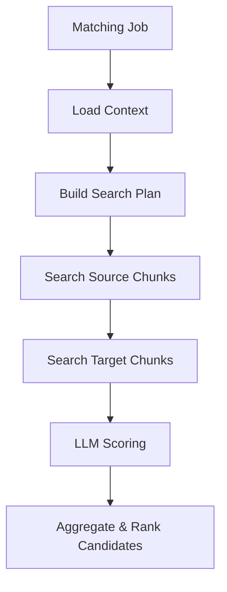

# Matching Package

## High-Level Flow

## Package Layout
- `context.py` – loads job, source, and target entity artefacts.
- `planning.py` – turns job configuration into weighted search criteria.
- `search.py` – executes vector lookups for source and target entities.
- `evaluation.py` – wraps the two-stage LLM rating and reasoning prompts.
- `results.py` – aggregates scores/coverage for downstream persistence.
- `engine.py` – public orchestration entrypoint (`run_matching_job`).
- `interfaces.py` – abstractions for vector search, embeddings, and LLMs.
- `exceptions.py` – package-specific errors for callers to handle.

## Execution Outline
1. Load the matching job context (source entity bundle + candidate bundles).
2. Build a search plan from template/job configuration (`search_criteria`).
3. Collect representative source snippets per criterion via the vector searcher.
4. Search each target entity with the same criteria to surface candidate chunks.
5. Ask the LLM to rate each criterion (GOOD/NEUTRAL/BAD) and justify the call.
6. Aggregate ratings into an average score and coverage-derived error margin.
7. Expose structured results and reasoning so callers can persist or render them.

## Key Decisions
- Treat `MatchingTemplate.config` + `MatchingJob.config_override` as the source of structured search criteria to avoid expanding the schema prematurely.
- Require dependency injection for vector search/LLM providers so we can swap concrete implementations in tests or future services without touching the core pipeline.
- Normalise LLM prompts to a two-step flow (rating then reasoning) to keep control over answer formats before we design structured storage for explanations.

## Suggestions
1. Implement provider helpers (e.g., `WeaviateVectorSearcher`, OpenAI/GPT client) and wire them into the Celery task that executes `run_matching_job`.
2. Add persistence of `MatchCandidate.to_dict()` output into `Match`/`MatchFeature` records or a new audit table to make results queryable.
3. Consider caching source snippets on the job to avoid re-querying Weaviate if the job is retried.

## Data Model Gaps / Proposed Changes
- **Structured criteria**: persist a first-class `MatchingSearchCriterion` model (or schema-validated JSON) linked to `MatchingTemplate` so requests like "prioritise culture fit" do not rely on loose JSON.
- **Per-criterion scoring**: introduce a model (e.g., `MatchAssessment`) that stores the rating, reasoning, and chunk references for transparency; `MatchFeature` could be repurposed but currently only allows a single label per match.
- **Chunk traceability**: store references to the `DocumentChunk` ids returned by search so reviewers can inspect the exact passages used during evaluation.

## Open Questions
- How should we prioritise ranking when multiple criteria disagree (e.g., GOOD on culture fit but BAD on compensation)?
- What thresholds should translate average scores into surfaced matches vs. filtered-out candidates?
